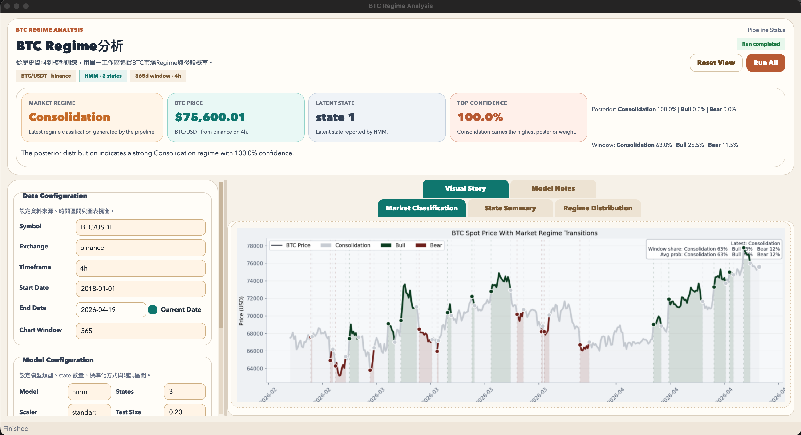
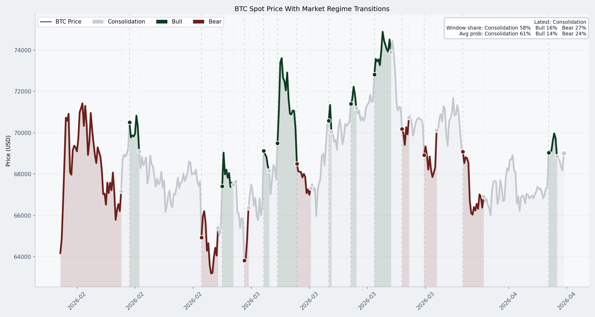
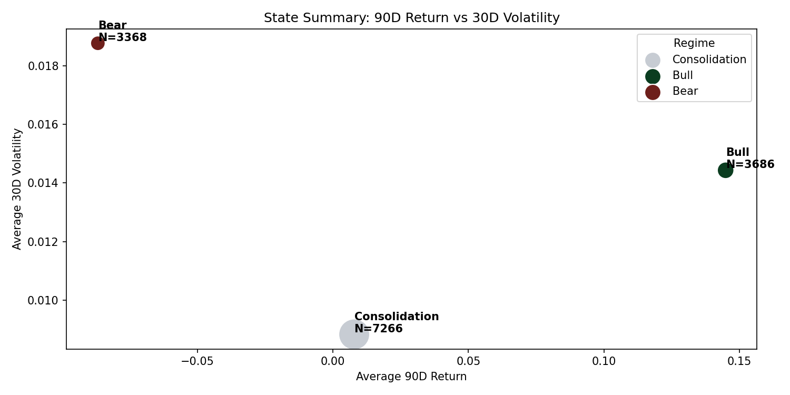
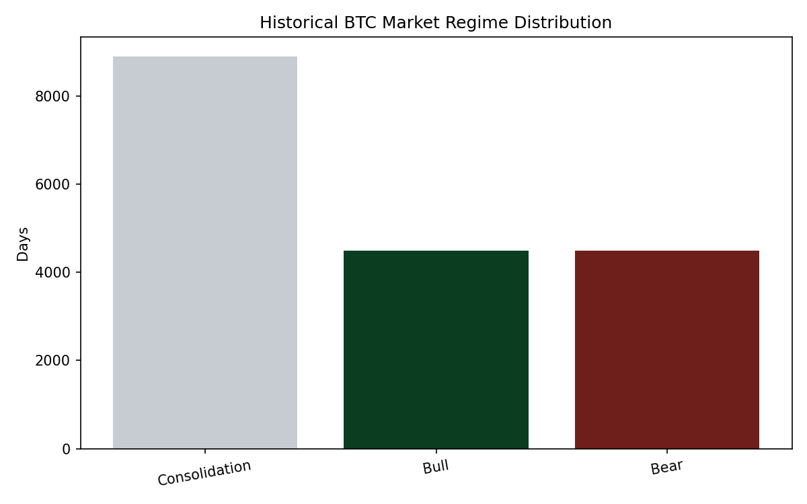
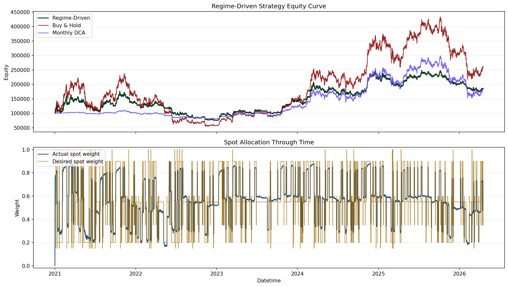

# BTC Regime分析工具

用 `ccxt` 抓取 BTC 現貨歷史價格，建立技術分析特徵並正規化後，透過無監督學習分析市場潛在狀態。專案同時提供：

- `HMM`：不需要事前標記牛市 / 熊市 / 盤整，讓模型自己學 latent states
- `KMeans`：將市場分成 3 群後，再依據報酬與波動做後驗命名
- `Qt GUI`：用桌面介面完成抓資料、訓練、預測與圖表查看

## 專案截圖

### GUI 介面



### 輸出圖表

| 市場分類圖 | 狀態摘要圖 |
|---|---|
|  |  |



## 目錄

- [功能特色](#功能特色)
- [快速開始](#快速開始)
- [GUI 使用方式](#gui-使用方式)
- [CLI 使用方式](#cli-使用方式)
- [HMM 模式說明](#hmm-模式說明)
- [實作細節](#實作細節)
- [輸出檔案](#輸出檔案)
- [專案結構](#專案結構)
- [名詞解釋](#名詞解釋)
- [常見問題](#常見問題)
- [後續可擴充方向](#後續可擴充方向)

## 功能特色

- 使用 `ccxt` 抓取 BTC 現貨歷史 K 線
- 建立多組技術分析特徵並做正規化
- 支援 `HMM` 與 `KMeans` 兩種無監督市場狀態分析
- 顯示目前市場狀態、後驗機率與 HMM 狀態轉移傾向
- 產生模型檔、狀態摘要與視覺化圖表
- 提供 `PySide6` 桌面 GUI，降低使用門檻

## 快速開始

### 1. 安裝相依套件

建議使用 Python 3.10 以上。

```bash
python3 -m venv .venv
source .venv/bin/activate
pip install -r requirements.txt
```

Windows:

```bash
.venv\Scripts\activate
pip install -r requirements.txt
```

### 2. 啟動 GUI

```bash
python main.py
```

### 3. 第一次使用建議流程

1. 在 GUI 保持預設值
2. `Model` 選 `hmm`
3. `States` 保持 `3`
4. 點 `Run All`
5. 等待 log 完成後查看右側圖表與摘要

如果你只想用命令列，也可以直接執行：

```bash
python main.py --cli
```

## GUI 使用方式

啟動：

```bash
python main.py
```

### 介面配置

GUI 視窗預設 1700×860px，最小寬度 1600px。介面分為三大區塊：

```
┌─────────────────────────────────────────────────────────────────────────────┐
│  Header (heroCard)                                                          │
│  ┌───────────────────────────────┐  ┌────────────────────────────────────┐│
│  │ BTC REGIME ANALYSIS           │  │       Pipeline Status (badge)      ││
│  │ 從歷史資料到模型訓練，用單一  │  │  [Ready to run]    [Reset] [Run]  ││
│  │ 工作區追蹤BTC Regime       │  └────────────────────────────────────┘│
│  │ 與後驗概率。                 │                                          │
│  │ [BTC/USDT·binance] [HMM·3]   │                                          │
│  │ [365d window·4h]             │                                          │
│  └───────────────────────────────┘                                          │
├─────────────────────────────────────────────────────────────────────────────┤
│  Market Pulse Panel (178px)                                                  │
│  ┌─────────────┐ ┌─────────────┐ ┌─────────────┐ ┌─────────────┐             │
│  │ Market     │ │ BTC Price   │ │ Latent      │ │ Top         │             │
│  │ Regime     │ │             │ │ State       │ │ Confidence  │             │
│  │ Bull       │ │ $105,230    │ │ state 1     │ │ 73.2%       │             │
│  │ Latest reg │ │ BTC/USDT    │ │ HMM         │ │ Bull holds  │             │
│  └─────────────┘ └─────────────┘ └─────────────┘ └─────────────┘             │
│  Execute the pipeline...    │  Posterior: Bull 73.2% | Bear 18.1%...        │
├─────────────────────────────────────────────────────────────────────────────┤
│                    │                                                        │
│  Left Panel        │  Right Panel (contentTabs)                             │
│  (440px fixed)    │  (flexible)                                             │
│                    │                                                        │
│  ┌──────────────┐  │  ┌──────────────┬──────────────┬───────────────┐        │
│  │Data Config  │  │  │ Visual Story │ Model Notes │               │        │
│  │ Symbol      │  │  │              │              │               │        │
│  │ Exchange    │  │  │ [Chart 1]    │ Model        │               │        │
│  │ Timeframe   │  │  │              │ Diagnostics  │               │        │
│  │ Start Date  │  │  │ [Chart 2]    │              │               │        │
│  │ End Date    │  │  │              │ Execution   │               │        │
│  │ Chart Window│  │  │ [Chart 3]    │ Log          │               │        │
│  └──────────────┘  │  │              │              │               │        │
│                    │  └──────────────┴──────────────┴───────────────┘        │
│  ┌──────────────┐  │                                                        │
│  │Model Config  │  │                                                        │
│  │ Model       │  │                                                        │
│  │ States      │  │                                                        │
│  │ Scaler       │  │                                                        │
│  │ Test Size    │  │                                                        │
│  │ Min Regime R │  │                                                        │
│  └──────────────┘  │                                                        │
│                    │                                                        │
│  ┌──────────────┐  │                                                        │
│  │ Runbook     │  │                                                        │
│  └──────────────┘  │                                                        │
│                    │                                                        │
└────────────────────┴────────────────────────────────────────────────────────┘
```

### Header 區塊

- **左側**： eyebrow 標籤、標題、副標題、三個情境 badge（ Symbol·Exchange / Model·States / Days·Timeframe）
- **右側**： Pipeline Status 徽章、Reset View / Run All 按鈕
- **下方**： Market Pulse 面板（固定高度）

### Market Pulse 面板

四張 MetricCard + 敘述文字 + 機率資訊：

| 卡片 | 內容 |
|------|------|
| **Market Regime** | 當前市場狀態：Bull / Bear / Consolidation |
| **BTC Price** | 最新收盤價 |
| **Latent State** | 模型內部狀態編號（state 0 / 1 / 2） |
| **Top Confidence** | Posterior 中最高的數值（如 73.2%）|

敘述區顯示 `Summary`（Market Read）和右側的 `Posterior` / `Window Distribution`。

### Left Panel（左側面板）

三個摺疊式 GroupBox：

**Data Configuration**
- Symbol（交易對）
- Exchange（交易所）
- Timeframe（K線週期）
- Start Date / End Date（時間區間）
- Chart Window（圖表顯示天數）

**Model Configuration**
- Model（HMM / KMeans）
- States（狀態數）
- Scaler（正規化方式）
- Test Size（測試集比例）
- Min Regime Run（僅 KMeans 顯示，防止 flickering 的最短狀態持續天數）

**Runbook**
- 建議工作流程說明

### Right Panel（右側面板）

兩個分頁：

**Visual Story**
- Market Classification：K線圖 + Regime 著色 + 切換標記
- State Summary：各 state 的 90D return vs 30D volatility 散點圖
- Regime Distribution：歷史 Regime 分布長條圖

**Model Notes**
- Model Diagnostics：訓練後的 metrics、regime 特徵輪廓
- Execution Log：Pipeline 執行過程與 highlights

## CLI 使用方式

### 抓取歷史資料

```bash
python collect_data.py \
  --symbol BTC/USDT \
  --exchange binance \
  --start-date 2018-01-01 \
  --timeframe 4h
```

常用參數：

- `--symbol`：交易對，例如 `BTC/USDT`
- `--exchange`：交易所，例如 `binance`、`okx`、`bybit`
- `--start-date`：起始日期，例如 `2018-01-01`
- `--end-date`：結束日期，不填則使用今天
- `--timeframe`：K 線週期，例如 `4h`、`1d`、`1h`

### 訓練 HMM

```bash
python train.py --model hmm --states 3 --scaler standard --test-size 0.2
```

### 訓練 KMeans

```bash
python train.py --model kmeans --states 3 --scaler standard --test-size 0.2 --min-regime-run 6
```

### 訓練 + Rolling Window 驗證

```bash
python train.py --model hmm --states 3 --rolling-val \
  --rolling-train-window 1000 \
  --rolling-val-window 100 \
  --rolling-step 50
```

### 用本地資料做預測

```bash
python predict.py --days 180
```

### 抓最新資料並預測

```bash
python predict.py --update --symbol BTC/USDT --exchange binance --timeframe 4h --days 30
```

### Forward Return 分析

整合版腳本放在 `scripts/forward_returns_analysis.py`，可用 `--mode` 切換：

- `regime`：看單一 regime 的 baseline forward return
- `transition`：看 regime 切換事件的 forward return

直接執行：

```bash
python scripts/forward_returns_analysis.py --mode regime
python scripts/forward_returns_analysis.py --mode transition
```

或用 run script：

```bash
bash scripts/run_forward_returns_analysis.sh regime
bash scripts/run_forward_returns_analysis.sh transition
```

這支腳本會：

- 讀取 `predict.py` 產生的 regime 預測結果
- 依 `--mode` 切換成 regime baseline 分析或 transition event 分析
- 統計未來 `7 / 30 / 90` 天報酬的平均、中位數、勝率與分位數
- 預設輸出：
  - `results/regime_forward_returns_summary.csv`
  - `results/regime_forward_returns_detail.csv`
  - `results/regime_forward_returns.png`
  - `results/transition_forward_returns_summary.csv`
  - `results/transition_forward_returns_detail.csv`
  - `results/transition_forward_returns.png`

### 現貨策略回測

#### 如何執行

```bash
# 方式一：直接執行（使用預設參數）
bash scripts/run_backtest.sh

# 方式二：手動指定參數
python scripts/backtest.py \
  --input results/regime_predictions_4h.csv \
  --initial-cash 100000 \
  --dca-monthly-investment 1562.5 \
  --start-date 2022-01-01 \
  --end-date 2026-04-19 \
  --rebalance-threshold 0.20 \
  --max-weight-step 0.25 \
  --transition-cooldown-bars 6 \
  --min-regime-bars 6
```

腳本 `scripts/run_backtest.sh` 會自動根據起訖日期計算月數，均分初始資金後執行。

#### 三策略績效比較（2021-01-01 ~ 2026-04-17，$100,000 初始本金）

| 指標 | Regime-Driven | Buy & Hold | Monthly DCA |
|---|---|---|---|
| **Final Equity** | $186,425 | **$262,436** | $183,966 |
| **Total Return** | +86.4% | **+162.4%** | +84.0% |
| **CAGR** | +12.5% | **+20.0%** | +12.2% |
| **Max Drawdown** | -57.1% | -77.0% | **-48.9%** |
| **Sharpe Ratio** | 0.52 | **0.60** | 0.54 |
| **Trade Count** | 397 | — | 64 |
| **Avg Spot Weight** | 56.4% | 100% | — |

> 修正 `min_regime_bars` 後，現行 default regime-driven 策略不再具備 beat buy-and-hold 的證據。它降低了 buy-and-hold 的最大回撤，但 final equity、CAGR、Sharpe 都落後。

#### 權益曲線比較圖



如上圖所示，Regime-Driven（綠色）在熊市期間會降低曝險，但也會在強勢上漲區間少拿 BTC beta。修正後的策略更接近風險控制 overlay，而不是已驗證的 beat-B&H alpha strategy。

#### 策略邏輯

策略基於 Regime 與 Transition 訊號，採用**下一根 bar open 價執行**，避免 look-ahead bias。規則如下：

| Priority | Trigger Type | Trigger | Target Spot Weight | 交易邏輯 |
|---|---|---|---:|---|
| 1 | Transition | `Bear -> Bull` | 100% | 強反轉確認，積極全倉回補 |
| 2 | Transition | `Bear -> Consolidation` | 60% | 跌勢鈍化，開始分批承接 |
| 3 | Transition | `Consolidation -> Bull` | 85% | 盤整後突破，順勢加碼 |
| 4 | Transition | `Bull -> Consolidation` | 35% | 漲勢降溫，先行減碼 |
| 5 | Transition | `Bull -> Bear` | 15% | 結構轉弱，保留小核心部位 |
| 6 | Transition | `Consolidation -> Bear` | 20% | 盤整轉弱，防守優先 |
| 7 | Regime | `Bull` | 90% | 多頭趨勢 baseline，續抱為主 |
| 8 | Regime | `Consolidation` | 55% | 中性市場，保留核心倉位 |
| 9 | Regime | `Bear` | 20% | 空頭市場，避免把每次回調當抄底 |

**優先順序**：先看是否有符合的 Transition 規則（優先級 1-6），沒有的話才套用 Regime 規則（優先級 7-9）。

#### 仓位管理與風控

- **目標倉位**：根據上表之 target weight，計算 `spot_weight = btc * close_price / equity`
- **Regime 確認延遲（min-regime-bars）**：Regime 改變後需連續 6 根 bar 都維持同一狀態，才視為有效 transition 並觸發調倉。目的是消除 regime flicker（38.6% 的 regime runs <= 6 bars）造成的錯誤訊號
- **Rebalance 門檻**：目標與實際倉位差距 ≥ 20% 才觸發調整（經 threshold sweep 分析，20% 最優）
- **Step Limit**：每次最多調整 25%，模擬分批加減碼避免一次性鉅額交易（經 sweep 分析，25% 為最佳值）
- **Transition Cooldown**：Transition 規則觸發成交後，冷卻 6 根 bar 才允許再次調倉（sweep 顯示 6 為甜蜜點，過長會明顯變差）
- **執行假設**：
  - 手續費：單邊 0.05%（5 bps）
  - 滑價：10 bps（0.1%），以 open 價執行時額外加成

#### 策略研究與優化結論

研究腳本：

```bash
python scripts/research_strategy.py
```

預設採用 coarse-to-fine 掃描；若要跑完整笛卡兒參數網格，可加上 `--full-grid`，但耗時會明顯增加。

輸出：

- `results/strategy_research_train.csv`
- `results/strategy_research_holdout.csv`
- `results/strategy_research_cost_stress.csv`
- `results/strategy_research_date_robustness.csv`
- `results/strategy_research_report.md`
- `results/strategy_research_top_equity.png`

目前研究採用固定切分：

- Train：`2021-01-01` ~ `2024-09-08 20:00`
- Holdout：`2024-09-09 00:00` ~ latest available prediction

結論：train 區間可以找到勝過 buy-and-hold 的參數組合，但 top train candidates 在 holdout 全部未能打贏 buy-and-hold。最佳 holdout 組合如下：

| 參數 | 預設值 | 結論 |
|---|---|---|
| `strategy_preset` | `custom_weights` | regime-only 比 transition rules 更穩定，但仍未打贏 B&H |
| `bull_weight` | `0.75` | 多頭仍低於滿倉，降低 upside capture |
| `consolidation_weight` | `0.25` | 中性區間明顯降曝險 |
| `bear_weight` | `0.35` | 熊市仍保留核心現貨 |
| `min_regime_bars` | `24` | 約 4 天確認，交易更少、回撤更低 |
| Holdout final equity | `$122,087` | B&H 為 `$139,570` |
| Holdout CAGR | `13.2%` | B&H 為 `23.1%` |
| Holdout max drawdown | `-18.4%` | B&H 為 `-49.8%` |

> 目前未找到 beat-B&H edge。最佳候選只能定位為降低回撤的 risk overlay，不應宣稱為可打贏 buy-and-hold 的策略。

#### 三策略說明

| 策略 | 說明 |
|---|---|
| **Regime-Driven** | 主動倉位策略，根據 Regime 狀態與 Transition 訊號動態調整現貨倉位（20%~100%） |
| **Buy & Hold** | 初始資金於第一根 bar open 全部投入，持有不動 |
| **Monthly DCA** | 初始資金均分為 N 等分（ N = 測試區間月數），每月第一根 bar open 定投 |

三策略初始本金相同（$100,000），可公平比較絕對值與報酬率。

#### 輸出檔案

- `results/backtest_summary.csv` — 績效指標摘要
- `results/backtest_trades.csv` — 所有策略交易明細
- `results/backtest_equity_curve.csv` — 逐 bar 權益曲線（含三策略對照）
- `results/spot_strategy_rules.csv` — 策略規則表
- `results/backtest_equity_curve.png` — 三策略權益曲線與倉位變化圖

### 一鍵 CLI 流程

```bash
python main.py --cli
```

這會依序執行：

1. 抓資料
2. 用預設 `HMM` 訓練模型
3. 做最新預測並更新圖表

## HMM 模式說明

HMM 模式的重點是：訓練時不需要事前準備「哪一天是牛市 / 熊市 / 盤整」這類人工標籤。

整體流程如下：

1. 以 BTC 歷史價格建立技術分析特徵
2. 對特徵做正規化
3. 用 `GaussianHMM` 學習潛在 hidden states
4. 訓練完成後，再依據每個 state 的平均：
   - `30D return`
   - `90D return`
   - `30D volatility`
   - `ADX`
   - `RSI`
5. 把各 state 後驗命名為 `Bull / Bear / Consolidation`

所以：

- 模型本身是無監督學習
- `Bull / Bear / Consolidation` 是訓練後的解讀結果，不是事前標籤

此外，目前的 HMM 推論不是只看原始 state mapping，還會加上一層較接近交易直覺的後處理：

- `Consolidation override`：當多個中性條件同時成立時，會把結果往盤整推
- `Bear priority`：當下跌特徵夠明確時，優先判為 `Bear`
- `Bull priority`：當上漲特徵夠明確時，優先判為 `Bull`

這樣做的目的是避免：

- 明顯下跌卻被判成盤整
- 明顯上漲卻被判成盤整
- 只修正空頭、不修正多頭造成偏差

## 實作細節

### 資料流程

1. 用 `ccxt` 抓取 BTC spot OHLCV
2. 預設 timeframe 為 `4h`
3. 原始資料儲存在 `data/btc_ohlcv.csv`
4. 訓練與推論都從同一份特徵工程流程產生欄位

### 特徵工程

目前特徵分成幾類：

- **趨勢與報酬**
  - `returns_1d / 7d / 30d / 90d`
  - `price_sma20_ratio / sma50_ratio / sma200_ratio`
  - `trend_strength_50_200`
  - `ema_gap_ratio`
- **動能**
  - `rsi_14 / rsi_28`
  - `macd_hist_ratio`
  - `roc_12 / roc_26`
  - `price_momentum_14`
- **波動與區間**
  - `volatility_7d / volatility_30d`
  - `hist_vol_30d`
  - `bb_width / bb_position`
  - `atr_ratio`
  - `range_20_ratio / range_50_ratio`
- **盤整敏感特徵**
  - `vol_compression_7_30`
  - `price_sma20_abs`
  - `ema_gap_abs`
  - `rsi_mid_distance`
  - `macd_hist_abs`
  - `bb_mid_distance_abs`
  - `atr_compression_14_30`
  - `direction_flip_rate_20`
  - `direction_balance_20`

`HMM` 會使用一組較精簡、偏 regime 分析的特徵子集（共 19 個），`KMeans` 使用完整特徵集（共 42 個）。

### KMeans 實作

- 先做 `3` 群分群
- 再依各 cluster 的平均報酬、波動與趨勢特徵做後驗命名
- `Min Regime Run` 只套用在 `kmeans`，預設 `6` 根蠟燭
- 目的在於減少 KMeans 常見的短週期來回切換（flickering）
- 當一個 regime 長度 < 指定的 min_run_length，會被合併到相鄰的 regime

### HMM 實作

- 使用 `GaussianHMM`，covariance_type 為 `diag`
- 預設 `3 states`，跑 `5` 次初始化取 log-likelihood 最高者
- 用時間序列順序切分 train / test，不做隨機打散
- `metadata.json` 會保存：
  - `state_to_regime`（latent state → regime 映射）
  - state summary（各 state 的統計特徵）
  - evaluation metrics
  - transition matrix（狀態轉移機率矩陣）
  - HMM postprocess rules

### 後處理邏輯（Postprocess）

`postprocess.py` 對 HMM 輸出的 posterior 做三層調整：

1. **Consolidation override**：當 entropy ≥ 0.85（模型不確定）+ 多個中性指標同時成立（ADX 低、BB 偏離小、方向翻轉頻繁等）→ Boost 盤整概率 ×1.2
2. **Bear priority**：當多個空頭指標同時成立（7D/30D 報酬低、EMA gap 負、MACD histogram 負等）→ Boost 熊市概率
3. **Bull priority**：當多個多頭指標同時成立（7D/30D 報酬高、EMA gap 正、MACD histogram 正等）→ Boost 牛市概率

每次調整後都會做 `smooth_regime_sequence` 去除短於 3-6 根蠟燭的噪音切換。

### 圖表顯示

目前 `Market Classification` 採用單張整合圖：

- 黑色主價格線
- regime 區段沿價格路徑加粗著色（灰=Consolidation、深綠=Bull、深紅=Bear）
- regime 顏色往下填到基準線
- 切換點用小圓點與淡虛線標示
- 右上角卡片顯示：Latest regime、Window share（時間占比）、Avg prob（平均後驗概率）

另外兩張圖的用途是：

- `State Summary`：看各 state / regime 的平均 90D return、30D volatility 與樣本數
- `Regime Distribution`：看整體資料中各 regime 的占比

## 輸出檔案

### 資料

- `data/btc_ohlcv.csv`：BTC 歷史 K 線資料

### 模型

- `models/model.pkl`：訓練好的模型
- `models/scaler.pkl`：特徵正規化器
- `models/feature_cols.txt`：訓練使用的特徵欄位
- `models/metadata.json`：模型類型、state 對應、評估指標、state 摘要、HMM 轉移矩陣、regime 特徵輪廓

### 圖表

- `results/market_classification.png`：BTC 價格與市場狀態分類圖
- `results/state_summary.png`：各 latent state 的報酬與波動摘要
- `results/regime_distribution.png`：市場狀態分佈
- `results/regime_feature_profile.png`：各 regime 的特徵輪廓 heatmap（Effect Size vs 整體平均）
- `results/rolling_validation.png`：Rolling Window 驗證結果（regime 穩定性、entropy 趨勢）

## 專案結構

```text
bull_bear_consolidation/
├── collect_data.py      # 資料獲取（ccxt）
├── features.py          # 特徵工程（技術指標）
├── train.py             # 模型訓練（HMM / KMeans）
├── predict.py           # 推論與圖表生成
├── postprocess.py       # HMM 後處理（Consolidation override / Bear/Bull priority）
├── analysis.py          # 滾動窗口驗證 + Regime 可解釋性分析
├── gui.py               # PySide6 桌面 GUI
├── main.py              # 啟動入口
├── README.md
├── requirements.txt
├── docs/
│   └── images/          # 截圖
├── data/               # BTC OHLCV CSV
├── models/             # 訓練產出的模型檔
└── results/            # 圖表輸出
```

## 名詞解釋

### Posterior Distribution（後驗概率）

模型對**當前這一刻**屬於各 regime 的概率估計。三個數值（Consolidation / Bull / Bear）加起來 = 100%。

- 73%+ 表示高確信
- 40-60% 表示模型不確定，可能在過渡區間

### Top Confidence

後驗概率中最高的那個數值，即模型對當前狀態的「確定程度」。

### Window Share（時間占比）

在設定的窗口天數內，每天取 Posterior 最高的 regime，統計各 regime 佔了多少天。

例如窗口 365 天中有 200 天被分類為 Bull → Window Share: Bull = 200/365 ≈ 55%

### Avg Posterior（平均後驗概率）

窗口期內，所有時間點的 Posterior 概率的平均值。

例如 365 天每天的 Bull posterior 分別是 [90%, 85%, 80%, ...]，取平均 = Avg Posterior。

### Window Share vs Avg Posterior 的差異

當模型**確信**時，兩者幾乎相同（如 [90%, 6%, 4%]）。
當模型**不確定、過渡區間**時，兩者會分岔：

| 情境 | Window Share | Avg Posterior |
|------|-------------|---------------|
| 穩定牛市 | Bull 100% | Bull 90% |
| 模糊牛市 | Bull 100% | Bull 55%（三天分別是 90%, 55%, 20%）|

### Min Regime Run

KMeans 的平滑參數。防止 Regime 在短於 N 根蠟燭內來回切換，默認 6（約等於 1 天的 4h 週期）。

HMM 不需要此參數，因為有 Transition Matrix 自動提供時間連貫性。

## 常見問題

### GUI 打不開怎麼辦？

先確認你已安裝：

```bash
pip install -r requirements.txt
```

尤其是 `PySide6` 和 `hmmlearn`。

### 為什麼 HMM 沒有事前標籤，還是顯示 Bull / Bear / Consolidation？

因為這些名稱不是訓練標籤，而是模型學出 hidden states 後，再根據各 state 的統計特徵做後驗命名。

### 為什麼 Window Share 和 Avg Posterior 看起來都一樣？

這說明模型在大多數時候都很**確信**，Posterior 分布是 [90%, 6%, 4%] 這種明顯一面倒的情況。

只有當模型經常給出模糊 posterior（[40%, 33%, 27%]），兩者才會明顯分岔。

### 如果結果看起來不太合理怎麼調？

可以優先調整：

- `--states`（3-state 最容易對應成牛 / 熊 / 盤整）
- `--timeframe`（4h 比 1d 更容易看到短期 bull / bear 切換）
- `Min Regime Run`（KMeans 專用，越大越平滑）
- HMM postprocess 的 `bull_priority` / `bear_priority` 條件強度

### 抓資料失敗怎麼辦？

常見原因：交易所 API 限制、網路不穩、交易對或 timeframe 不支援。

建議回到最穩定的組合：`BTC/USDT` + `binance` + `4h`。

## 後續可擴充方向

- 自動比較 `2 / 3 / 4 / 5` 個 hidden states
- 加入 AIC / BIC 協助選擇最佳狀態數
- 支援 ETH、SOL 等其他幣種
- 匯出 PDF / HTML 報告
- 在 GUI 加入進度條、參數儲存、批次回測

## 快速指令整理

啟動 GUI：

```bash
python main.py
```

抓資料：

```bash
python collect_data.py --symbol BTC/USDT --exchange binance --start-date 2018-01-01 --timeframe 4h
```

訓練 HMM：

```bash
python train.py --model hmm --states 3 --scaler standard --test-size 0.2
```

抓最新資料並預測：

```bash
python predict.py --update --symbol BTC/USDT --exchange binance --timeframe 4h --days 30
```

如果你想最快開始使用，直接執行 `python main.py` 然後在 GUI 內按 `Run All` 即可。
